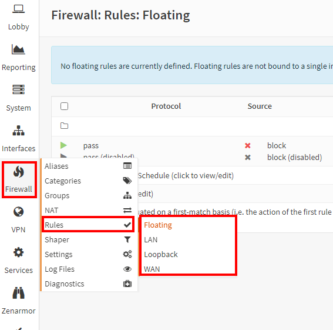

# OPNsense Firewall: Blocking IP's, Ports, and Protocols**

In this project, I explored the OPNsense firewall, a tool crucial for
network security. The focus was on understanding and implementing
firewall rules and aliases to manage and secure networks effectively.
The goal was to grasp practical insights into blocking specific IPs,
protocols, and ports while optimizing organizational efficiency through
alias usage.

Beginning with the firewall interface overview, I navigated to the
firewall tab on the left-hand side of OPNsense. This section encompasses
various options, with a focus on Aliases, Rules, Settings, and Log Files
for this module.

Before delving into specific settings, I went into Settings \> Advanced
to disable IPv6, ensuring a streamlined configuration. The process
involved turning off Allow IPv6 and adjusting Firewall Optimization
under Miscellaneous to the normal setting. These configurations were
saved to implement the changes.

Moving on to real-time monitoring, I accessed Log Files \> Live View to
gain insights into the firewall's current activities. This provided a
dynamic view of the firewall's actions, offering valuable feedback.
Additionally, the Overview section provided a graphical representation
of firewall activity.

**Part 2 - Configure Aliases**

In the second part, I focused on configuring aliases, an essential
aspect of firewall management. Aliases allow for the grouping of IP
addresses, networks, and ports under a single, easy-to-reference name.
This simplifies rule creation and management.

Moving on to real-time monitoring, I accessed Log Files \> Live View to
gain insights into the firewall's current activities. This provided a
dynamic view of the firewall's actions, offering valuable feedback.

Additionally, the Overview section provided a graphical representation
of firewall activity.

**Part 2 - Configure Aliases**

Aliases play a pivotal role in organizing and simplifying administration
tasks. They serve as placeholders for actual hosts, networks, or ports,
allowing for streamlined management. In this demonstration, I
meticulously configured aliases for the three devices on the network:
Firewall, PC1, and PC2. This strategic use of aliases reduces the need
to manually input IP addresses for each rule, enhancing efficiency.

I navigated to the Firewall section and accessed Aliases, an essential
step to manage and organize entities effectively.

To create a new Alias, I clicked the plus sign, initiating the process
of defining a placeholder for various network entities.

We will create an Alias for the firewall by entering the following:

**Name: Firewall_Def_Gateway.**

**Type: Host(s).**

**Content: 192.168.2.1**

**Description: OPNsense Default Gateway.**

Click Save. I created an Alias named "Firewall_Def_Gateway" representing
the OPNsense Default Gateway, specifying its type, content, and
providing a description for clarity.

Now we will repeat the same steps to create another Alias for PC1 and
name it AdminPC for our scenario: I replicated the process to create an
Alias named "AdminPC" for PC1, ensuring efficient management by using
aliases rather than individual IP addresses.

Make sure to check the IP address first by running ipconfig. For my
case, it is 192.168.2.11. Before creating the Alias for PC1, I verified
its IP address by running 'ipconfig,' noting it as 192.168.2.11.

I created an Alias for the firewall by entering the following:

**Name: Firewall_Def_Gateway.**

**Type: Host(s).**

**Content: 192.168.2.1**

**Description: OPNsense Default Gateway.**

**Click Save.**

I created an Alias named "**Firewall_Def_Gateway**" representing the
OPNsense Default Gateway, specifying its type, content, and providing a
description for clarity.

I replicated the process to create an Alias named "AdminPC" for PC1,
ensuring efficient management by using aliases rather than individual IP
addresses.

Make sure to check the IP address first by running ipconfig. For my
case, it is 192.168.2.11.

Before creating the Alias for PC1, I verified its IP address by running
'ipconfig,' noting it as 192.168.2.11.

**Name: AdminPC**

**Type: Host(s)**

**Content: 192.168.2.11**

**Description: PC1 (Admin)**

I established the "AdminPC" Alias with the corresponding details.

Following a similar approach, I created an Alias named "GuestPC" for
PC2, obtaining its IP address as 192.168.2.10.

**Name: GuestPC**

**Type: Host(s)**

**Content: 192.168.2.10**

**Description: PC1 (Admin)**

I configured the "GuestPC" Alias with the relevant details.

To efficiently manage web traffic, I created a port alias to simplify
rule creation for HTTP and HTTPS.

**This time, we will add an alias for all web traffic, so that we will
not have to make separate rules for HTTP and HTTPS every time:** I
created an Alias encompassing all web traffic, streamlining rule
creation for both HTTP and HTTPS.

I applied the changes, ensuring the new aliases are active.

I emphasized the significance of aliases in simplifying configurations
and enhancing organization.

With the aliases established, I proceeded to configure rules, leveraging
the organized and simplified structure provided by aliases.

**Part 3 - Rules: Blocking IP’s**

I navigated to the Firewall tab and accessed the Rules section.

**Priority: The firewall will go from top to bottom when reading rules;
the rules on top will have the highest priority:** Understanding the
significance of rule priority, I ensured a top-to-bottom approach for
effective rule processing.

**From top to bottom, the priority is as follows:**

1.  **System Rules:**

- I acknowledged the existence of OPNsense's built-in rules, realizing
  their unchangeable and highest-priority nature.

2.  **Floating:**

- Emphasizing the versatility of floating rules, I considered their
  priority over interface-specific rules.

3.  **Interface Group:**

- I highlighted the importance of grouping interface rules for efficient
  management.

4.  **Interfaces:**

- Acknowledging individual interface rules, I stressed their lower
  priority but specificity.

 

**Blocking IP’s:**

In this phase, I created a LAN rule to prevent PC2 communication and
ensured that PC2 could ping the firewall and access the internet.

Before proceeding with rule configurations, I initiated a series of ping
tests from PC2 to both the firewall (192.168.2.1) and an external server
(8.8.8.8, representing Google's DNS server). This step aimed to confirm
PC2's current connectivity status.

**Figure: A verification window showing PC2 can access the internet on
the browser**

With the successful ping tests confirming PC2's connectivity, I
navigated to PC1's OPNsense firewall settings and accessed the Rules
section specifically for the LAN interface.

I observed the presence of automatically generated rules on the upper
right, representing system rules. By clicking on the arrow next to “4,”
I could view these rules. These system rules have the highest priority
by default.

I acknowledged the existence of default rules allowing all LAN traffic.
While these rules can be deleted, they are initially in place to ensure
basic connectivity. It's important to note that OPNsense follows a
default deny-all philosophy, meaning that without specific rules, all
traffic is denied at the system level. I emphasized a security-oriented
approach, suggesting that focusing on essential allowed traffic is more
effective than trying to block specific "bad" things. This philosophy
aligns with a well-configured network that employs aliases to allow only
necessary traffic while blocking everything else by default.

This groundwork of connectivity verification and understanding default
rules sets the stage for configuring specific rules to control traffic
effectively.

To implement a rule for blocking PC2, I opted for the "**Reject**"
action instead of "Block." This choice was deliberate, as the "Reject"
action allows us to observe detailed logs of the blocked packets,
providing transparency and insights into the traffic handling.

I set the direction of the rule to "in" since the pings from PC2 were
considered incoming traffic to the firewall interface.

Ensuring compatibility with the IPv4 protocol, I specified this
parameter in the rule configuration.

When defining the source for the rule, I utilized the alias
functionality. Specifically, I searched for and selected the "guests"
alias, streamlining the rule configuration process by referencing the
pre-established alias for PC2.

To encompass all other aspects not covered by the specified parameters,
I set the remaining configurations to "any," effectively blocking all
additional traffic.

To ensure comprehensive logging of packets affected by this rule, I
enabled the option to log packets handled by the rule. This step
enhances visibility into the firewall's activities and aids in
troubleshooting.

Adhering to best practices, I provided values for both the category and
description fields associated with the rule. This organizational
approach contributes to a well-structured and easily manageable rule
set.

After configuring the rule parameters, I saved the settings to implement
the rule within the OPNsense firewall.

Recognizing the importance of rule priority, I took the necessary step
of reordering the rules to ensure that the newly created rule takes
precedence over the default "allow all" rules. This proactive adjustment
prevents potential conflicts and ensures the effective implementation of
the intended block rule.

Utilizing the OPNsense interface, I selected the newly created rule and
executed a priority adjustment, moving it ahead of the existing rules.
This action ensures that the rule will be applied before other rules in
the sequence.

With the rule configurations in place, I initiated the application of
changes through the "Apply Changes" function within the OPNsense
firewall interface. This step finalizes the rule adjustments and brings
the changes into effect.

To validate the impact of the rule, I proceeded to PC2 and attempted to
ping the firewall and access the internet. This real-world testing
provides immediate feedback on the rule's effectiveness in blocking the
specified traffic.

Following the testing on PC2, I assessed the outcomes to determine
whether the rule successfully prevented ping requests and internet
access. This evaluation serves as a crucial verification step for the
configured rule.

To gain deeper insights into the firewall's behavior and understand the
specifics of blocked traffic, I navigated back to the firewall settings
and accessed the Log Files section. This step involves reviewing the
logs to interpret the recorded events related to the applied rule.

Within the Log Files section, I specifically accessed the Live View
feature. This real-time monitoring capability allows for the dynamic
observation of firewall activities, providing immediate feedback on
traffic events.

Upon examining the Live View, I visually confirmed the active operation
of the rule. This verification step reinforces the rule's functionality
and confirms that it is actively blocking the designated traffic.

In the interest of testing and experimentation, I opted to disable the
rule temporarily. This action allows for the observation of changes in
PC2's connectivity when the rule is not in effect.

**Part 3 - Rules: Blocking specific protocols**

To enforce a rule blocking ICMP traffic from PC2 to the firewall, I
navigated to the LAN rules section within the OPNsense firewall
interface.

As a prerequisite, I ensured that PC2 could ping the firewall before
implementing the rule. This preliminary verification step helps
establish a baseline for testing the rule's effectiveness.

Returning to the Firewall Rules page under LAN settings, I prepared to
create a new rule to regulate ICMP traffic.

I initiated the rule creation process by clicking the "Add" button,
signaling my intent to define a new rule within the LAN rules
configuration.

In configuring the rule, I opted for the "Reject" action instead of
"Block" to allow for logging of blocked packets. This decision enhances
visibility into the rule's impact on ICMP traffic.

Maintaining consistency with the direction of ICMP traffic, I specified
the rule to operate on incoming traffic, aligning with the nature of
pings directed towards the firewall interface.

In defining the protocol for this rule, I set it specifically for ICMP
traffic, targeting the ping functionality.

To streamline the rule configuration, I utilized the GuestPC alias by
typing "guest" in the source field, eliminating the need to remember or
manually input the IP address for PC2.

In the destination field, I entered "firewall" to locate and select the
alias associated with the firewall. It's noteworthy that an existing
alias for the firewall is available by default in the drop-down menu.

To ensure comprehensive logging of packets affected by this rule, I
activated the option to log packets handled by the rule. Enabling this
feature contributes to a detailed understanding of the firewall's
actions.

Adhering to best practices, I assigned values to both the category and
definition fields, promoting an organized and easily understandable rule
set.

After configuring the rule parameters, I saved the settings and applied
the changes. This step ensures that the rule becomes active within the
firewall.

As part of the testing process, I proceeded to PC2 and attempted to ping
the firewall. This step allows for immediate feedback on whether the
rule successfully blocks ICMP traffic from PC2.

Returning to the firewall rules configuration, I accessed the relevant
section to review and manage the rules currently in place.

Recognizing the importance of rule priority, I adjusted the rule
sequence to ensure that the ICMP block rule takes precedence over the
default "allow all" IPv4 rules. This adjustment is crucial to guarantee
the rule's effectiveness.

Using the OPNsense interface, I executed the necessary steps to move the
ICMP block rule to a position of higher priority, ensuring it is
processed before the less restrictive IPv4 allow all rule.

With the rule sequence adjusted, I applied the changes within the
OPNsense interface and proceeded to retest PC2's ability to ping the
firewall. This iterative testing approach helps verify the rule's
functionality.

Post-adjustment testing allowed me to assess whether the rule
modifications were effective in blocking ICMP traffic from PC2. This
step serves as a crucial validation of the rule adjustment.

To gain deeper insights into the firewall's behavior and verify the
logging functionality, I navigated to the Log Files section within
OPNsense and accessed the Live View feature. This step allows for
real-time monitoring and verification of the rule's impact on traffic.

Within the Log Files section, I specifically accessed the Live View
feature. This real-time monitoring capability allows for the dynamic
observation of firewall activities, providing immediate feedback on
traffic events.

Through the Live View, I visually confirmed the active operation of the
rule, validating that ICMP traffic from PC2 to the firewall was
successfully blocked. This confirmation reinforces the effectiveness of
the rule.

**Concluding Remark**

By navigating firewall interfaces and implementing rules, I successfully
configured and tested various security scenarios. The project covered
crucial aspects, including creating aliases and applying rules for
enhanced security. The emphasis on real-time verification and log
analysis deepened my understanding of the firewall's functionality. As I
conclude this project, I've not only applied OPNsense firewall features
practically but also gained a foundation for effective network security
management in diverse settings.
